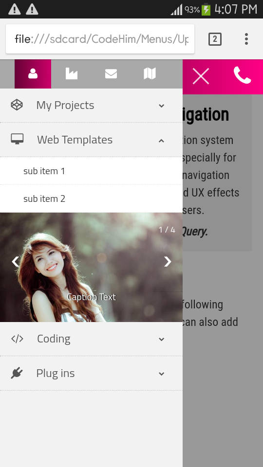

# developer-nav
A responsive multifunction navigation system for personal blog, portfolio, and especially for writers &amp; developer's sites. This navigation comes with multiple UI features and UX effects that friendly interact with users.  Written in HTML, CSS and jQuery.

<h2> Main Features </h2>
<ol>
<li>+20 built in skins, attractive plain colors &amp; gradients colors. </li>
 <li>Fully responsive - will adapt to any device. </li>
<li>Fixed on top (optional). </li>
<li> Unlimited sub item can be added to a drop down.  </li>
<li> CSS transitions with jQuery fallback. </li>
<li> Chrome, Safari, Firefox, Opera, IE7+, IOS, Android and windows phone supported. </li>

<li> Slide and Fade Effects. </li>
<li> Clean and simple HTML structure. </li>
<li> Auto width, Vertical Slide, Adaptiveheight. </li>
<li> Font Awesome icons installed.</li>
<li> SEO and user friendly. </li>
<li> Easy to navigate, simple to implement and customize. </li>

</ol>
 <h2> Mobile View</h2>

<h2> UI Features</h2>

The "Developer Nav" navigation has following built-in features, besides these, you can also add according to your choice.  

<ul>
<li>Portfolio </li>
<li>Contact Form</li>
<li>Navigation Links</li>
<li>Hamburger Menu Trigger</li>
<li> Phone Call Button </li>
<li> Drop Downs</li>
<li> Image Gallery (Slide Show) </li>
</ul>
